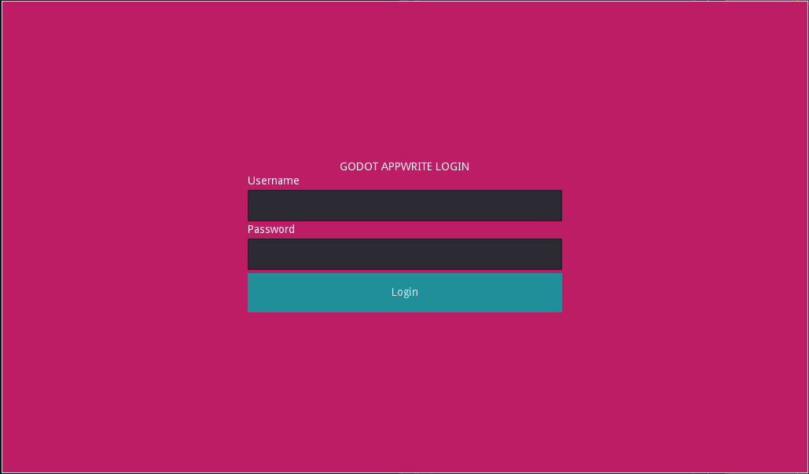
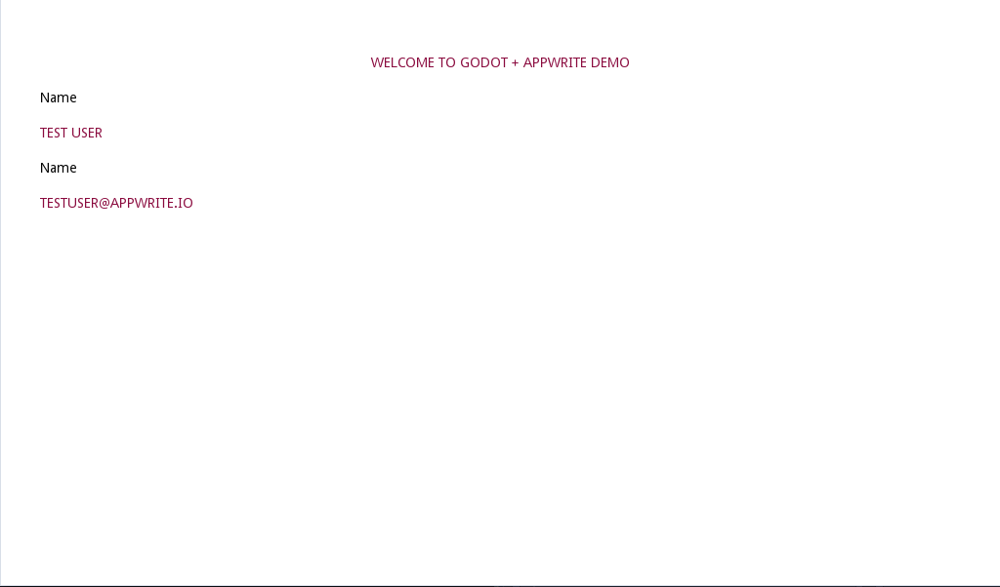

# Appwrite ❤️ Godot

Hey, this is a small sample of how we can integrate Godot with [Appwrite](https://appwrite.io). If you don't know what Appwrite is, please visit [https://appwrite.io](https://appwrite.io).

## Screenshots
|  |  |
|---------------------------------|-------------------------------|

## Getting started
Replace the `projectid` and `endpoint` in `scripts/appwrite.gd` to your own project and endpoint. You can find those in your Appwrite console. Then run the project. You can login using the user you can add in your Appwrite console.

### Learn more
You can use followng resources to learn more and get help
- 📜 [Appwrite Docs](https://appwrite.io/docs)
- 💬 [Discord Community](https://appwrite.io/discord)